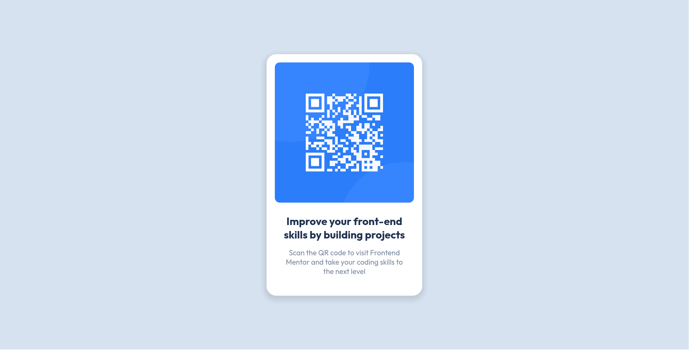

# Frontend Mentor - QR code component solution

This is a solution to the [QR code component challenge on Frontend Mentor](https://www.frontendmentor.io/challenges/qr-code-component-iux_sIO_H). Frontend Mentor challenges help you improve your coding skills by building realistic projects.

## Screenshot

## Links

- Solution URL: [Add solution URL here](https://your-solution-url.com)
- Live Site URL: [Add live site URL here](https://your-live-site-url.com)

## What I learned

This project was supposed to refresh my knowledge about basics of HTML/CSS. It was also a great oporunity to start with Frontend Mentor excersises.

## Built with

- HTML5
- CSS

## Author

Jakub Małecki:

- [@Frontend Mentor](https://www.frontendmentor.io/profile/maleckijakub)
- [@Linkedin](https://www.linkedin.com/in/jakub-ma%C5%82ecki-b05453183)
